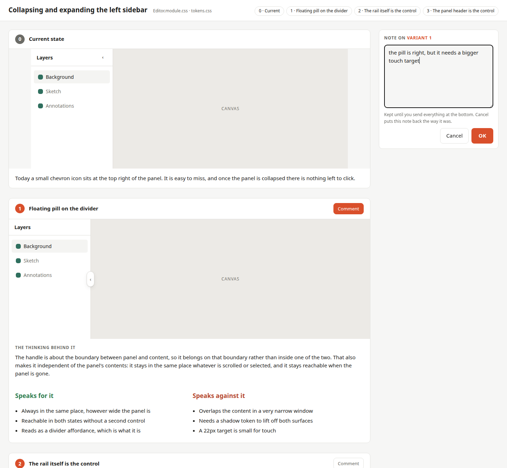

# Agent skills

Skills for coding agents, kept under version control. A skill is a folder with a
`SKILL.md` and optional extras under `scripts/`, `assets/` and `references/`.
They follow the [Agent Skills](https://agentskills.io) open format, so they work
in Claude Code, Codex, Cursor, Gemini CLI, GitHub Copilot, OpenCode, Amp, Goose
and other agents that read it.

## Skills in this repo

| Skill | What it does |
| --- | --- |
| [`ui-variants`](skills/ui-variants/) | Turns a user-interface question into 3-5 numbered, operable HTML variants built from the application's real tokens and real CSS, opens them in the browser, and takes the reply straight back into the session. |

## ui-variants

Design questions are hard to settle in chat. "A floating handle on the divider"
produces two different pictures in the agent's head and in yours, and you only
find out once it is built. This skill reverses the order: see first, then decide.



Each variant is a real, clickable rebuild inside its own iframe, using the
project's own token file and component stylesheet - so what you judge is close
to what you would get.

You reply in two ways, and both go in the same submission. Each variant has a
Comment button that opens a note panel beside it, so you can write about a
variant while it is still in front of you. The form at the bottom takes the
pick and anything that fits none of them - a variant nobody has drawn yet, for
instance. The answer lands in the agent's session without you copying anything,
and every round is kept in a history that is shown again next time.

### How to ask for it

Name the skill when you want it deliberately. In Claude Code that is a slash
command; other agents take the same sentence as plain prose.

```
/ui-variants the sidebar needs a way to collapse and expand. What could that look like?
```

```
/ui-variants I don't like the chevron for collapsing the sidebar, it is too easy to miss
```

You don't have to name it, though. The agent reaches for the skill on its own
when you say something bothers you, ask for alternatives, or send a screenshot
with a complaint - the word "variant" never has to come up:

```
The collapse button feels wrong to me. Can we do better?
```

The one thing worth being precise about is **how much of the screen you mean**.
"The sidebar handle" gets you four sharp answers to one question; "the editor"
gets you four whole screens that are expensive to build and hard to compare
against each other. Saying whether it is the look or the behaviour that bothers
you helps too - for behaviour the agent knows the variants have to be clickable
rather than pretty pictures.

**A screenshot alongside the text is worth a lot.** It settles which element you
mean without a round of questions, and it becomes variant 0 on the comparison
page - the anchor everything else is judged against. Without it the agent has
to start your application to capture one itself, which it often cannot do
behind a login or a build step, and then you end up comparing the designs
against your memory of the current state. Memory is more generous than
reality. Crop it to the part you are complaining about plus a little of its
surroundings.

### Try it

No installation needed, no dependencies - Python 3.9+ and a browser:

```bash
python3 skills/ui-variants/scripts/show_variants.py examples/sidebar-handle
```

That opens the page above, built from
[`examples/sidebar-handle/`](examples/sidebar-handle/). Pick a variant and
submit: the command prints your choice as JSON and exits, which is exactly how
an agent reads it back.

## Install

Two ways in. On Claude Code the plugin route needs no clone and updates itself;
everywhere else you clone this repo and link the skill folder into the
directory your agent scans.

### Claude Code, as a plugin

A marketplace here is nothing more than a catalogue file in this repository
listing what can be installed from it. You add the catalogue once, then install
from it by name:

```
/plugin marketplace add ChristianHartmann/skills
/plugin install ui-variants@hartmann-skills
/reload-plugins
```

`ui-variants` is the plugin, `hartmann-skills` the catalogue it came from.
Later updates are `/plugin marketplace update` - there is no version to bump
here, so every commit counts as a new one.

Installed this way the skill is namespaced by its plugin, so the explicit
invocation becomes `/ui-variants:ui-variants`. Nothing changes for the usual
case where the agent reaches for it on its own.

### Anywhere else, by symlink

```bash
git clone https://github.com/ChristianHartmann/skills.git
cd skills
```

Then link rather than copy, so this repo stays the single source of truth.
After the first edit to a copied version, nobody knows which of the two is
current.

| Agent | Command |
| --- | --- |
| Claude Code | `ln -s "$PWD/skills/ui-variants" ~/.claude/skills/ui-variants` |
| Codex | `mkdir -p ~/.agents/skills && ln -s "$PWD/skills/ui-variants" ~/.agents/skills/ui-variants` |
| Cursor | `mkdir -p ~/.agents/skills && ln -s "$PWD/skills/ui-variants" ~/.agents/skills/ui-variants` |
| Others | see [`references/generic.md`](skills/ui-variants/references/generic.md) |

Use `.claude/skills/` or `.agents/skills/` inside a repository instead to scope
a skill to one project. Each agent's exact paths, its background-execution
idiom and its limits are in
[`skills/ui-variants/references/`](skills/ui-variants/references/).

If there is already a real directory at the target, clear it first - but check
whether it holds changes this repo is missing:

```bash
diff -r ~/.claude/skills/ui-variants skills/ui-variants
```

## Bundled scripts

`skills/ui-variants/scripts/` holds two tools that are useful outside the skill
too. Both are standard library only.

- `show_variants.py` - builds the comparison page, serves it locally, opens the
  browser and takes the choice back via POST. `--build-only` writes a single
  self-contained HTML file instead; `--no-browser` serves without launching one;
  `--timeout` bounds the wait for agents that cut off long-running commands.
- `css_collisions.py` - finds class names that are defined in more than one CSS
  file. When CSS modules are concatenated outside the bundler they silently
  override each other, and you end up looking for the bug in your own markup.

## Working on a skill

Skills are prompts, not programs - they cannot be compiled, and unit tests only
reach the scripts around them. What does carry:

- **Try it on a real case** rather than judging it at the desk. Most honest with
  a fresh agent that gets nothing but the instructions: what it gets wrong is a
  gap in the instructions, not a fault of the agent.
- **Ask for criticism after the run.** Where were the instructions unclear, what
  had to be guessed, what cost time for nothing? That feedback is the actual
  yield of a test run.
- **Pour repeated manual work into a script.** If an agent does the same tedious
  thing on every run, it belongs in `scripts/` - done right once instead of
  reinvented every time.
- **Write down the why, not just the what.** An instruction whose reason is
  stated gets applied sensibly; one without gets followed to the letter and
  applied wrongly at the next edge case.

## Tests

```bash
python3 -m unittest discover -s tests -t tests
```

No dependencies. The suite covers both scripts and validates `SKILL.md` against
the Agent Skills specification, so a rename in the JSON contract cannot silently
drift apart from the documentation.

## Licence

[MIT](LICENSE).
